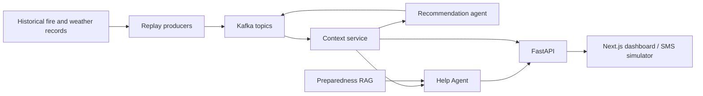

# FireLink

**An SMS-first wildfire communication and community-intelligence platform.**

FireLink explores how communities can access understandable wildfire information when connectivity, device access, or emergency-information systems are constrained. The project combines a simulated SMS experience, a web dashboard, replayed wildfire and weather records, retrieval-assisted guidance, and an event-streaming backend.

FireLink began at the **2026 United Nations–UC San Diego Reboot the Earth Hackathon**, where the original project received first place. It is now being developed from a hackathon prototype into a maintainable open-source MVP and systems-research platform.

> Note:
> FireLink is currently a research and demonstration prototype. It replays historical and simulated data, does not contact emergency services, and must not be relied upon for evacuation orders or immediate safety decisions. In an emergency, follow instructions from local authorities and contact emergency services directly.

## Contents

- [Project objectives](#project-objectives)
- [Current capabilities](#current-capabilities)
- [Architecture](#architecture)
- [Technology stack](#technology-stack)
- [Getting started](#getting-started)
- [Service URLs](#service-urls)
- [API overview](#api-overview)
- [Repository structure](#repository-structure)
- [Important terminology](#important-terminology)
- [Roadmap](#roadmap)
- [Troubleshooting](#troubleshooting)
- [Contributing](#contributing)

## Project objectives

- Provide a low-barrier, SMS-oriented interface for wildfire information.
- Present concise, localized, and multilingual guidance.
- Preserve the source, timestamp, freshness, and simulation status of operational data.
- Continue operating in defined degraded modes when optional AI services fail.
- Explore resilient communication, distributed systems, local AI, and agent interoperability.
- Develop toward open-source and Digital Public Goods best practices.

## Current capabilities

FireLink is an **MVP prototype under architectural revision**. The current repository demonstrates:

- Historical CAL FIRE incident and Open-Meteo weather replay.
- Kafka topics for fire, weather, and AI-generated recommendations.
- FastAPI endpoints for fire incidents, weather alerts, context, community data, recommendations, and simulated SMS.
- A multilingual Help Agent using operational context, shelter data, mock user profiles, and retrieved preparedness information.
- A Next.js dashboard for wildfire conditions, community needs, resources, households, and chat.
- An experimental MCP server that exposes context and mock-dispatch tools.
- Docker Compose orchestration and basic smoke testing.

The current implementation is not yet offline, connected to a real SMS provider, or backed by a live authoritative emergency feed.

## Architecture

### Current implementation



This diagram describes the current implementation, not the final target architecture. The current request path is being reviewed to reduce direct dependencies on Kafka and hosted AI services.

For more detail, see:

- [`docs/architecture-breakdown.md`](docs/architecture-breakdown.md)
- [`docs/streaming-pipeline.md`](docs/streaming-pipeline.md)

## Technology stack

| Area | Current technology |
| --- | --- |
| Frontend | Next.js, TypeScript, Tailwind CSS, Leaflet, Recharts |
| API | Python, FastAPI, Pydantic, SQLAlchemy |
| Event streaming | Apache Kafka with ZooKeeper |
| Persistence | SQLite |
| AI | OpenAI recommendation agent and Anthropic Help Agent |
| Retrieval | Pinecone with OpenAI embeddings |
| Interoperability experiment | FastMCP |
| Local orchestration | Docker Compose and Make |

Hosted AI and retrieval services are current implementation choices, not permanent architectural requirements. Ollama and LocalAI are being evaluated as local alternatives.

## Getting started

### Prerequisites

- Docker Desktop with Docker Compose v2
- Node.js 20 or newer with npm
- Python 3.10 or newer for host-side utilities
- Make

Verify the required tools:

```bash
docker --version
docker compose version
node --version
npm --version
python3 --version
```

### 1. Clone the repository

```bash
git clone https://github.com/Firelink-Reboot-The-Earth-UN-Project/firelink.git
cd firelink
```

### 2. Configure the backend

Create `backend/.env` with the credentials required by the current hosted implementation:

```env
OPENAI_API_KEY=
ANTHROPIC_API_KEY=
PINECONE_API_KEY=
PINECONE_INDEX_NAME=
```

Note: Never commit `.env` or API credentials.

### 3. Start the backend stack

```bash
cd backend
make check
make up-build
```

Wait for Kafka and the backend to start, then verify the services:

```bash
make ps
make health
```

The first build may take several minutes while Docker downloads images and installs dependencies.

### 4. Load preparedness documents

```bash
make ingest
```

This one-time step loads the included preparedness documents into the configured Pinecone index. It is required by the current RAG-enabled Help Agent.

### 5. Start the frontend

In a second terminal, from the repository root:

```bash
cd frontend
npm install
npm run dev
```

### 6. Run the smoke test

From `backend/`:

```bash
make test
```

The smoke test checks the containers, Kafka topics, REST endpoints, credentials, and simulated SMS pipeline.

## Service URLs

| Service | URL |
| --- | --- |
| Frontend dashboard | <http://localhost:3000> |
| Demonstration ZIP | <http://localhost:3000/dashboard/91001> |
| Backend API | <http://localhost:8000> |
| API documentation | <http://localhost:8000/docs> |
| Health endpoint | <http://localhost:8000/health> |
| Latest context | <http://localhost:8000/context/latest> |
| MCP server | <http://localhost:8001> |

## API overview

| Method | Endpoint | Purpose |
| --- | --- | --- |
| `GET` | `/health` | Check backend availability |
| `GET` | `/community/{zip}` | Retrieve demonstration community data |
| `GET` | `/context/latest` | Retrieve recent fire and weather context from Kafka |
| `GET` | `/fire-incidents` | List stored fire incidents |
| `POST` | `/fire-incidents` | Create a fire incident record |
| `GET` | `/fire-incidents/{id}` | Retrieve one fire incident |
| `PATCH` | `/fire-incidents/{id}` | Update one fire incident |
| `DELETE` | `/fire-incidents/{id}` | Delete one fire incident |
| `GET` | `/weather-alerts` | List stored weather alerts |
| `POST` | `/weather-alerts` | Create a weather alert record |
| `GET` | `/weather-alerts/{id}` | Retrieve one weather alert |
| `PATCH` | `/weather-alerts/{id}` | Update one weather alert |
| `DELETE` | `/weather-alerts/{id}` | Delete one weather alert |
| `GET` | `/agents/recommendations/latest` | Retrieve the latest AI-generated recommendation |
| `POST` | `/sms/inbound` | Submit a simulated inbound SMS message |

Use the interactive OpenAPI documentation at <http://localhost:8000/docs> for the exact request and response schemas.

## Repository structure

```text
firelink/
├── README.md                       # Project overview and quick start
├── backend/
│   ├── app/
│   │   ├── main.py                 # FastAPI application entry point
│   │   ├── core/                   # Database and Kafka configuration
│   │   ├── data/                   # Replay, community and mock data
│   │   ├── models/                 # SQLAlchemy database models
│   │   ├── schemas/                # Pydantic API schemas
│   │   ├── repository/             # Database access layer
│   │   ├── routes/                 # REST and simulated-SMS endpoints
│   │   ├── services/
│   │   │   ├── agents/             # Help and recommendation agents
│   │   │   ├── knowledge/          # RAG ingestion and retrieval
│   │   │   ├── producers/          # Fire and weather Kafka producers
│   │   │   ├── context_service.py  # Kafka context retrieval
│   │   │   ├── community_service.py
│   │   │   └── dispatch_service.py # Mock dispatch behavior
│   │   ├── mcp_server.py           # Experimental MCP interface
│   │   ├── run_agent.py
│   │   └── run_producer.py
│   ├── docs/                       # Preparedness documents for RAG
│   ├── test/                       # Smoke test and SMS CLI
│   ├── docker-compose.yml          # Local service orchestration
│   ├── Dockerfile
│   ├── Dockerfile.mcp
│   ├── Makefile
│   └── requirements.txt
├── frontend/
│   ├── src/
│   │   ├── app/                    # Next.js routes and ZIP dashboards
│   │   ├── components/             # Dashboard, fire, resource and chat UI
│   │   ├── lib/                    # API client, types and data adapters
│   │   └── data/                   # Frontend demonstration data
│   ├── package.json
│   └── README.md
└── docs/
    ├── architecture-breakdown.md   # Current full-stack architecture
    └── streaming-pipeline.md       # Kafka and data-flow documentation
```

## Project Roadmap

- [ ] Define versioned event schemas with source, timestamp, freshness, verification, and simulation metadata.
- [ ] Build a persistent current-state service so user requests do not create Kafka consumers.
- [ ] Separate deterministic safety rules from AI explanation and translation.
- [ ] Add explicit degraded modes for unavailable or stale data, retrieval, and model services.
- [ ] Consolidate duplicated RAG implementation and document locations.
- [ ] Add unit, integration, contract, failure, and AI-evaluation tests.
- [ ] Add continuous integration.
- [ ] Add structured logging, latency metrics, and dependency-health reporting.
- [ ] Add a license, contribution guide, code of conduct, ownership statement, and privacy documentation.
- [ ] Evaluate Ollama and LocalAI through a provider-independent model interface.
- [ ] Integrate a real messaging provider after the simulated workflow is safe and reproducible.
- [ ] Evaluate CoffeeAGNTCY/App SDK after the standalone architecture is stable.
- [ ] Prepare the project for Digital Public Goods assessment.

## Troubleshooting

### Container-name conflict

If Docker reports that a `firelink-*` container name is already in use, identify the old Compose project:

```bash
docker inspect \
  --format '{{ index .Config.Labels "com.docker.compose.project" }}' \
  firelink-zookeeper
```

Then stop that project without deleting its volumes:

```bash
docker compose -p <project-name> down
```

### Backend is not running

Inspect container status and logs:

```bash
docker compose ps -a
docker compose logs --tail=100 backend kafka zookeeper
```

If Python dependencies are missing, confirm `openai` and `anthropic` are listed in `backend/requirements.txt`, then rebuild:

```bash
docker compose build --no-cache backend recommendation-agent
docker compose up -d
```

### Frontend cannot reach the backend

1. Confirm `make health` succeeds from `backend/`.
2. Confirm `NEXT_PUBLIC_API_URL` points to `http://localhost:8000` unless intentionally overridden.
3. Restart `npm run dev` after changing frontend environment variables.

### Kafka has no messages

```bash
make logs-calfire
make logs-noaa
make topics
```

### Stop the project

```bash
cd backend
make down
```

`make down` preserves volumes. `make clean` removes project volumes and should be used cautiously.

## Contributing

FireLink is transitioning into an open-source project. Until formal contribution guidelines are added:

1. Open or select a focused GitHub issue.
2. Create a feature branch from `main`.
3. Keep changes small and document architectural decisions.
4. Add or update tests for behavioral changes.
5. Open a pull request explaining what changed, why, how it was tested, and any known limitations.

Do not commit credentials, personal information, or claims that simulated information or actions are official or live.

## Documentation

- [`backend/README.md`](backend/README.md) — backend setup, services, commands, and troubleshooting
- [`frontend/README.md`](frontend/README.md) — frontend setup and routes
- [`docs/architecture-breakdown.md`](docs/architecture-breakdown.md) — current full-stack architecture
- [`docs/streaming-pipeline.md`](docs/streaming-pipeline.md) — Kafka pipeline and context retrieval

**Thank you for checking out our project!!!**
